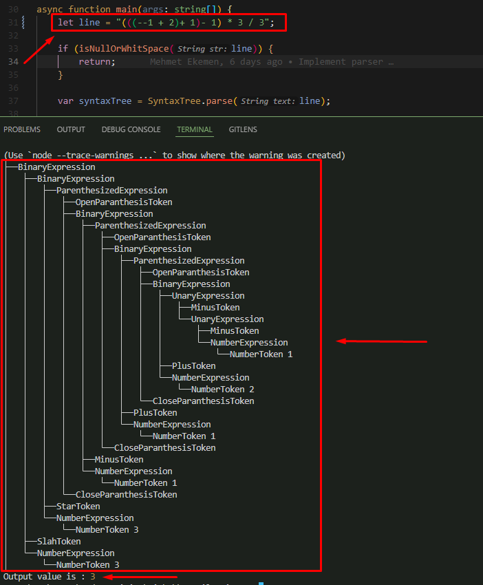

# Compiler-in-TS
Writing Typescript-Like Language Compiler in Typescript Language

Example
```ts
const line: string = "/* put your string here ...! */";
const parser = new Parser(line);
var expression = parser.Parse();

prettyPrint(expression);
```

use ts-node for runnig
```sh
node --loader ts-node/esm .\src\index.ts
```

